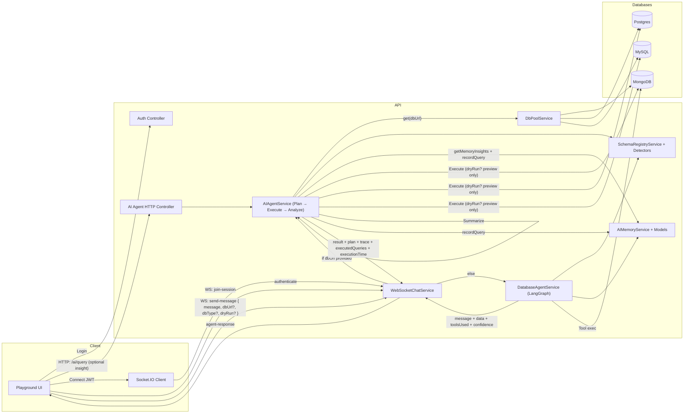
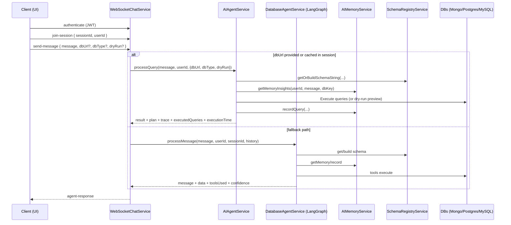
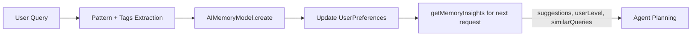
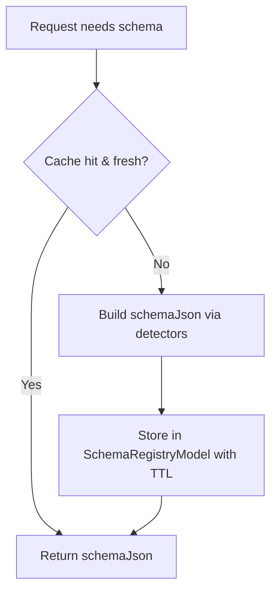

## AI Agent – Deep Dive Guide (Architecture, Principles, and Flows)

This document is your narrative-friendly, presentation-ready deep dive into how the AI Agent works. It explains the architecture, the exact flows for HTTP and WebSocket, the planning and execution pipeline, memory and schema lifecycles, security guardrails, and how to demo it so your audience finds it genuinely compelling.

### Why this agent is interesting
- **Plan → Execute → Analyze**: It builds a mini plan, executes safe queries across MongoDB/Postgres/MySQL, and summarizes results.
- **Memory that learns**: It tracks user patterns, preferences, and past queries to personalize responses.
- **Schema intelligence**: It caches schema in a registry and matches keywords to likely tables/collections to guide planning.
- **Real-time demoability**: WebSocket playground streams thinking, plan, executed queries, and results (with optional dry-run).
- **Defense-in-depth safety**: Aggressive SQL and Mongo guardrails, statement timeouts, and redaction features.

---

## High-level Architecture

Key modules (with code references):
- `AIAgentService` (src/services/ai-agent.service.ts): Core Plan → Execute → Analyze pipeline + memory, schema registry, and profiling.
- `WebSocketChatService` (src/services/websocket-chat.service.ts): Real-time chat, session memory, routing to either the AI Agent or LangGraph fallback.
- `DatabaseAgentService` (src/services/database-agent.service.ts): LangGraph StateGraph-based fallback conversational agent.
- `AIMemoryService` (src/services/ai-memory.service.ts) with models in `src/models/ai-memory.model.ts`: Records queries, extracts patterns/tags, updates user preferences.
- `SchemaRegistryService` (src/services/schema-registry.service.ts): Builds and caches structured schema JSON across DBs with TTL and summaries.
- `SchemaKeywordMatcherService` (src/services/schema-keyword-matcher.service.ts): Maps user keywords to candidate tables/collections.
- DB Pooling (`DbPoolService`) and SQL/Mongo helpers: Efficient, safe execution.

### System context diagram (HTTP + WebSocket)


---

## WebSocket message flow (session + routing)


---

## AIAgentService pipeline (Plan → Execute → Analyze)
```mermaid
flowchart TD
  A[Input userQuery, userId, dbOptions] --> B{Greeting/Small talk?}
  B -- Yes --> C[Compose general response]
  C --> Z[Return polite message + memoryInsights]
  B -- No --> D[DbPoolService.get(dbUrl, dbType)]
  D --> E[SchemaRegistry.getOrBuildSchemaString]
  E --> F[DataProfiler.getCapabilitiesSummary]
  F --> G[SchemaKeywordMatcher.match(userQuery, schemaJson)]
  G --> H{dryRun?}
  H -- Yes --> I[Generate queries + plan + trace without execution]
  H -- No --> J[Execute queries safely via pooled connections]
  I --> K[Summarize + shape response]
  J --> K[Summarize + shape response]
  K --> L[AIMemoryService.recordQuery]
  L --> Z[Return data/message + plan/trace/queries + metrics]
```

Key implementation points:
- Early shortcut for greetings avoids DB work and still updates memory with a conversational marker.
- Schema registry returns a JSON snapshot with totals and can be forced to refresh.
- Keyword matcher maps user intent to likely tables/collections as planning hints.
- Dry-run emits plan/trace/queries without executing (perfect for demos/audits).

---

## Memory lifecycle (learning over time)


What we store:
- Per-query: `userId`, `dbKey`, `query`, `generatedQuery`, `queryType`, `collections`, `executionTime`, `resultCount`, `wasSuccessful`, `contextTags`, `queryPattern`.
- Per-user preferences: `frequentCollections`, `queryHistory`, and a `learningProfile` including `skillLevel` that upgrades with usage.

How it’s used:
- `getMemoryInsights` returns similar queries and preferences; the agent personalizes explanations and suggestions accordingly.

---

## Schema registry lifecycle (performance + stability)


Highlights:
- Normalizes dbUrl, hashes a `dbKey`, and caches structured schema JSON.
- TTL-based freshness; optional `refreshSchema` to force rebuild.
- Stores summary counts to guide prompts and UI hints.

---

## Safety guardrails (defense in depth)

SQL:
- Block dangerous verbs (DROP/TRUNCATE/ALTER), require WHERE for UPDATE/DELETE.
- Single-statement, no comments, parameter placeholders required.
- Statement timeouts; pool size caps.

Mongo:
- Forbid `$where`/`$function`; disallow `$out`/`$merge` in ad-hoc aggregation.
- Require specific filters on writes; exclude sensitive fields from responses.

General:
- Redact SQL in responses if `REDACT_SQL_IN_RESPONSES=true`.
- Log JSON to files; pretty console logs for dev; hashed schema keys.

---

## HTTP Endpoint (concise)
- `POST /ai/query`
  - Body: `{ query: string, dbUrl: string, dbType?: 'mongodb'|'postgres'|'mysql', refreshSchema?: boolean, insight?: boolean, dryRun?: boolean }`
  - When `insight=true`, returns plan/trace/executedQueries and memoryInsights; otherwise a minimal payload.

## WebSocket Events (concise)
- Client → Server
  - `join-session { sessionId, userId }`
  - `send-message { message, sessionId, dbUrl?, dbType?, dryRun? }`
- Server → Client
  - `session-joined`, `message-received`, `agent-thinking`, `agent-response`, `typing-indicator`, errors

---

## Engineering principles
- **Safety first**: All execution passes through guardrails and timeouts.
- **Explainability**: Plan/trace/dry-run make the agent’s actions visible.
- **Performance by design**: Schema registry + pooling; avoid repeated introspection.
- **Progressive enhancement**: LLM optional—heuristics and schema hints still work.
- **Observability**: Structured logs and clear response metadata.

---

## Demo script (5–7 minutes)
1) Show login → JWT, then connect WebSocket and join a session.
2) Send a natural language query with `dryRun=true` to preview plan + queries without execution.
3) Toggle `dryRun=false`, rerun; highlight executedQueries, executionTime, and result summary.
4) Ask a similar follow-up; point out suggestions and memory-driven personalization (user level).
5) Switch DB (Mongo → Postgres), re-run; emphasize schema registry and keyword matching.
6) Show a dangerous SQL attempt; demonstrate guardrail rejection.

---

## Quickstart recap
1) `npm install`
2) Set `.env.development.local` with at least `SECRET_KEY`, `GOOGLE_API_KEY`, `PORT` (see `README.md` for all envs)
3) `npm run dev`
4) Open `playground/index.html` → Login → Join session → Chat

---

## Appendix: Where to find things in the code
- HTTP controller: `src/controllers/ai-agent.controller.ts`
- WebSocket: `src/services/websocket-chat.service.ts`
- Core agent: `src/services/ai-agent.service.ts`
- LangGraph fallback: `src/services/database-agent.service.ts`
- Memory models/services: `src/models/ai-memory.model.ts`, `src/services/ai-memory.service.ts`
- Schema registry/matcher: `src/services/schema-registry.service.ts`, `src/services/schema-keyword-matcher.service.ts`
- DB configs/env: `src/config/index.ts`, `.env.*`, `src/utils/validateEnv.ts`

