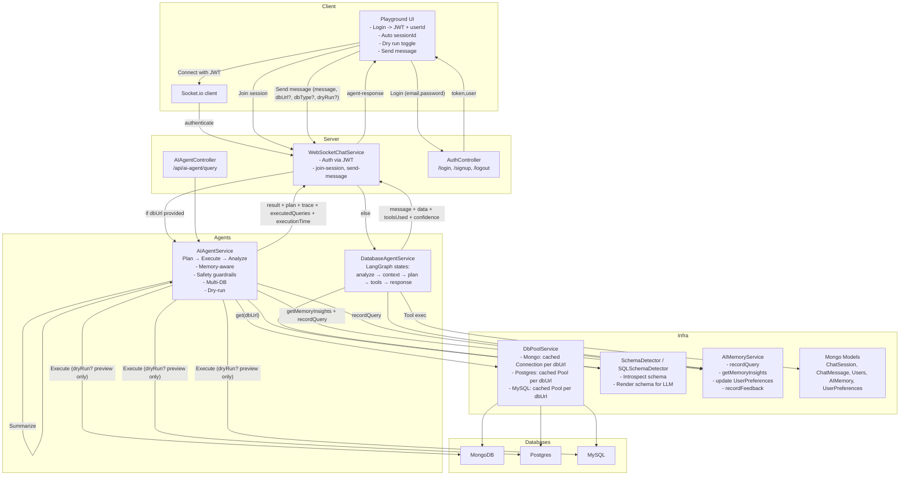

AI Agent API

Overview
This project is a production-grade AI Agent API that converts natural language into safe database operations and thoughtful answers. It supports MongoDB, Postgres, and MySQL, and includes a modern WebSocket playground for live demos. The agent plans, executes, and analyzes results, learns from user interactions, and enforces strict safety guardrails.

Key Features
- Multi-DB support: MongoDB, Postgres, MySQL
- Plan → Execute → Analyze agent workflow with dry-run preview
- Strong safety guardrails for SQL and Mongo
- User-specific memory and learning over time
- WebSocket chat with session management
- Playground: login-first flow, auto-fill JWT/userId/sessionId, dry-run toggle, plan/trace viewer
- Connection pooling and caching for performance

Quick Start
1) Install
```
npm install
```

2) Configure environment
Create .env.development.local with at least:
```
SECRET_KEY=your-jwt-secret
GOOGLE_API_KEY=your-google-gemini-api-key
PORT=3000

# Optional tuning
SCHEMA_REGISTRY_TTL_MS=86400000        # default 24h
DEFAULT_ROW_LIMIT=1000                 # cap for reads/aggregations
QUERY_TIMEOUT_MS=15000                 # SQL execution timeout
REDACT_SQL_IN_RESPONSES=false          # hide SQL text in responses
PG_POOL_MAX=10                         # Postgres pool size
```

3) Run in development
```
npm run dev
```

4) Open the playground
Open playground/index.html in a browser (served by your dev server, or open the file and point Server URL to your API host: http://localhost:3000).

Architecture
Client → Server → Agents → Infra → Databases
- Client: Playground with WebSocket client and login-first UX.
- Server: Express + Socket.io; routes messages, authenticates JWT, manages sessions.
- Agents:
  - AIAgentService: Plan → Execute → Analyze, multi-DB, safety guardrails, dry-run.
  - DatabaseAgentService: LangGraph state machine for legacy/fallback flow.
- Infra: DbPoolService (connection/pool cache), Schema Detectors, AIMemoryService, Mongoose models, Logger.
- Databases: MongoDB, Postgres, MySQL.

Mermaid Diagram (System)


Security & Guardrails
- SQL: block DROP/TRUNCATE/ALTER; require WHERE on UPDATE/DELETE; single-statement; no comments; parameterized placeholders ($1 or ?).
- Mongo: forbid $where/$function; disallow dangerous aggregation stages ($out/$merge); require specific filters on writes; exclude sensitive fields.

Planning & Dry-Run
- AIAgentService creates a small JSON plan using LLM.
- Dry run: generates queries and plan/trace without executing; great for audits and demos.
- Execute: runs queries through pooled connections, then summarizes results for the user.

Memory & Personalization
- AIMemoryModel stores each query, success, result counts, collections, tags, and pattern.
- UserPreferencesModel tracks frequent collections, query patterns, and learning profile.
- Each request updates memory and retrieves insights to shape prompts and suggestions.

Connection Pooling
- DbPoolService caches per-dbUrl:
  - Mongo: mongoose.Connection
  - Postgres: pg.Pool
  - MySQL: mysql2 Pool
- Benefits: reduced latency, fewer handshakes, resilience across requests.

Playground
- Login: prompts for email/password, captures token and userId.
- Auto IDs: decodes JWT to fill userId; auto-generates sessionId.
- Dry run: previews plan and queries without executing.
- Plan & Trace panel: displays plan JSON, executedQueries, and tool traces.

API Reference (Selected)
- Auth
  - POST /login -> { token, data }
  - POST /signup, POST /logout
- AI Agent
  - POST /api/ai-agent/query { query, dbUrl, dbType?, dryRun?, refreshSchema? }
  - GET /api/ai-agent/status, GET /api/ai-agent/samples
- WebSocket events
  - join-session { sessionId, userId }
  - send-message { message, sessionId, dbUrl?, dbType?, dryRun? }
  - typing, get-sessions, create-session, delete-session

Demo Script (Hackathon)
1) Login in the playground (get JWT + userId auto-filled) and join a session.
2) Dry-run a query (e.g., "Top 5 products by revenue last 30 days" with Postgres URI):
   - Show plan JSON and previewed SQL in Plan & Trace.
3) Uncheck Dry run and run the query; point out safety guardrails and single-statement enforcement.
4) Ask a follow-up question to demonstrate memory-based suggestions.
5) Show that greetings receive a friendly, non-query response.

Development
```
npm run dev        # start dev
npm run build      # compile with swc
npm test           # run tests
npm run lint       # lint
```

Notes
- Configure Google API key in environment for LLM calls.
- Provide valid dbUrl for the target database (Mongo/Postgres/MySQL).
 - Persistent Schema Registry: the agent caches per-DB schema (hashed key, credentials stripped) and refreshes after TTL. You can force rebuild by sending `refreshSchema: true` in the request.

