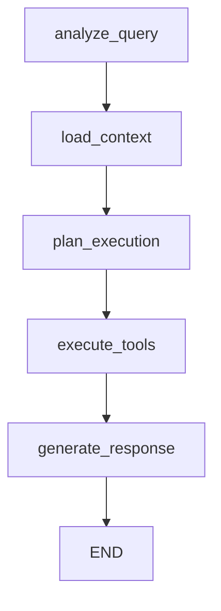

# WebSocket Chat Service with LangChain Agentic Flow

## 🚀 Overview

The WebSocket Chat Service provides a real-time, intelligent chat interface that leverages LangChain's agentic workflow to interact with your database. It combines the power of:

- **Real-time WebSocket Communication**
- **LangChain StateGraph for Agentic Workflows**
- **Dynamic Database Schema Detection**
- **User Memory and Learning**
- **Advanced Query Planning and Execution**

## 🏗️ Architecture

```
Frontend ↔ WebSocket ↔ Chat Service ↔ Database Agent ↔ LangChain StateGraph
                                    ↔ Memory Service
                                    ↔ Schema Detector
                                    ↔ MongoDB
```

### Core Components

1. **WebSocket Chat Service** - Handles real-time communication
2. **Database Agent Service** - LangChain-powered intelligent agent
3. **Chat Models** - MongoDB models for sessions and messages
4. **Memory Integration** - User-specific learning and context

## 🔧 Features

### WebSocket Features
- ✅ **Real-time messaging** with Socket.IO
- ✅ **Authentication** via JWT tokens
- ✅ **Session management** with automatic cleanup
- ✅ **Typing indicators** for better UX
- ✅ **Multi-session support** per user

### AI Agent Features
- ✅ **LangChain StateGraph** for complex workflows
- ✅ **Dynamic tool creation** based on database schema
- ✅ **Query planning and execution**
- ✅ **Confidence scoring** for responses
- ✅ **Follow-up question generation**
- ✅ **Thinking process visualization**

### Database Integration
- ✅ **Dynamic schema detection** for all collections
- ✅ **Intelligent query optimization**
- ✅ **Multi-collection support**
- ✅ **Aggregation pipeline generation**
- ✅ **Security** (password fields excluded)

## 📡 WebSocket Events

### Client → Server Events

```typescript
// Join a chat session
socket.emit('join-session', {
  sessionId: 'uuid',
  userId: 'user-id'
});

// Send a message
socket.emit('send-message', {
  message: 'Get all users created this week',
  sessionId: 'uuid'
});

// Typing indicator
socket.emit('typing', {
  sessionId: 'uuid',
  isTyping: true
});

// Session management
socket.emit('create-session', {
  userId: 'user-id',
  title: 'Database Analysis'
});

socket.emit('get-sessions', {
  userId: 'user-id'
});
```

### Server → Client Events

```typescript
// Session events
socket.on('session-joined', (data) => {
  console.log('Joined session:', data.session);
});

// Message events
socket.on('message-received', (message) => {
  console.log('New message:', message);
});

// AI Agent events
socket.on('agent-thinking', (thinking) => {
  console.log('Agent is thinking:', thinking.message);
});

socket.on('agent-response', (response) => {
  console.log('Agent response:', response);
  console.log('Tools used:', response.toolsUsed);
  console.log('Confidence:', response.confidence);
  console.log('Follow-up questions:', response.followUpQuestions);
});

// Error handling
socket.on('error', (error) => {
  console.error('Chat error:', error.message);
});
```

## 🤖 LangChain Agentic Workflow

### StateGraph Workflow



### Workflow Steps

1. **Analyze Query**
   - Determine user intent
   - Assess query complexity
   - Identify required operations

2. **Load Context**
   - Fetch database schema
   - Load user memory
   - Get conversation history

3. **Plan Execution**
   - Create step-by-step plan
   - Select appropriate tools
   - Optimize query strategy

4. **Execute Tools**
   - Run database operations
   - Handle multiple queries
   - Collect results

5. **Generate Response**
   - Synthesize final answer
   - Calculate confidence score
   - Generate follow-up questions

### Available Tools

```typescript
// Query users collection
{
  name: 'query_users',
  description: 'Query user data from the database',
  parameters: {
    filter: { type: 'object' },
    limit: { type: 'number' },
    sort: { type: 'object' }
  }
}

// Count documents
{
  name: 'count_documents',
  description: 'Count documents in any collection',
  parameters: {
    collection: { type: 'string' },
    filter: { type: 'object' }
  }
}

// Aggregation operations
{
  name: 'aggregate_data',
  description: 'Perform complex aggregations',
  parameters: {
    collection: { type: 'string' },
    pipeline: { type: 'array' }
  }
}
```

## 🔌 REST API Endpoints

### Session Management

```http
GET /chat/sessions
# Get user's chat sessions with pagination

GET /chat/sessions/:sessionId/history
# Get message history for a session

PUT /chat/sessions/:sessionId/title
# Update session title

DELETE /chat/sessions/:sessionId
# Delete a session
```

### Analytics & Search

```http
GET /chat/stats
# Get chat statistics and activity

GET /chat/search?query=users&limit=20
# Search messages across sessions
```

## 💾 Data Models

### Chat Session
```typescript
{
  id: string;
  userId: string;
  title: string;
  isActive: boolean;
  messageCount: number;
  lastActivity: Date;
  context: {
    currentTopic?: string;
    recentQueries?: string[];
    userPreferences?: any;
    databaseContext?: string[];
  };
}
```

### Chat Message
```typescript
{
  id: string;
  userId: string;
  sessionId: string;
  message: string;
  type: 'user' | 'agent' | 'system';
  timestamp: Date;
  metadata?: {
    queryType?: string;
    executionTime?: number;
    dataRetrieved?: boolean;
    toolsUsed?: string[];
    confidence?: number;
  };
}
```

## 🚦 Getting Started

### 1. Environment Setup

```env
# Add to your .env file
GOOGLE_API_KEY=your-google-gemini-api-key-here
```

### 2. Server Setup

The WebSocket service is automatically initialized when you start the server:

```bash
npm run dev
```

### 3. Client Connection

```javascript
import io from 'socket.io-client';

const socket = io('http://localhost:3000', {
  auth: {
    token: 'your-jwt-token-here'
  }
});

// Connection established
socket.on('connect', () => {
  console.log('Connected to chat service');
});
```

### 4. Basic Chat Flow

```javascript
// 1. Create or join a session
socket.emit('join-session', {
  sessionId: 'my-session-id',
  userId: 'user-123'
});

// 2. Send a message
socket.emit('send-message', {
  message: 'Show me all users created in the last week',
  sessionId: 'my-session-id'
});

// 3. Listen for agent response
socket.on('agent-response', (response) => {
  console.log('AI Response:', response.message);
  console.log('Data:', response.data);
  console.log('Suggestions:', response.followUpQuestions);
});
```

## 🎯 Example Conversations

### Database Query
```
User: "How many users do we have?"
Agent: "I found 1,247 users in the database. Would you like me to break this down by registration date or show you recent activity?"

Tools Used: [count_documents]
Confidence: 95%
Execution Time: 120ms
```

### Complex Analysis
```
User: "Show me users who registered this month and have Gmail addresses"
Agent: "I found 89 users who registered this month with Gmail addresses. Here's the breakdown:
- Week 1: 23 users
- Week 2: 31 users  
- Week 3: 35 users

Would you like to see their activity patterns or export this data?"

Tools Used: [query_users, aggregate_data]
Confidence: 87%
```

### Follow-up Context
```
User: "What about Yahoo users?"
Agent: "Based on our previous conversation about monthly registrations, I found 12 users with Yahoo email addresses who registered this month. That's significantly fewer than Gmail users (89). Would you like to compare with other email providers?"

Context: Remembers previous query about monthly registrations
```

## ⚙️ Configuration

### Chat Service Config
```typescript
{
  maxMessagesPerSession: 1000,
  maxSessionsPerUser: 10,
  sessionTimeoutMinutes: 60,
  enableTypingIndicator: true,
  enableThinkingProcess: true
}
```

### Performance Features
- **Automatic session cleanup** every 30 minutes
- **Message history limiting** to prevent memory issues
- **Connection pooling** for database operations
- **Schema caching** for faster responses

## 🔍 Monitoring & Analytics

### Real-time Metrics
- Active WebSocket connections
- Active chat sessions
- Message throughput
- Agent response times

### User Analytics
- Session duration
- Message frequency
- Query complexity trends
- Tool usage patterns

## 🛠️ Advanced Features

### Custom Tools
Extend the agent with custom database tools:

```typescript
// Add to DatabaseAgentService
new DynamicTool({
  name: 'custom_analysis',
  description: 'Perform custom data analysis',
  func: async (input: string) => {
    // Your custom logic here
    return result;
  }
});
```

### Memory Integration
The chat service automatically integrates with the existing AI memory system:
- Records successful queries
- Learns user patterns
- Improves suggestions over time
- Tracks query performance

This WebSocket chat service provides a powerful, intelligent interface for database interactions with real-time communication and advanced AI capabilities! 🎉
